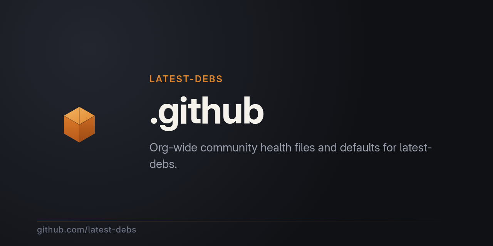

# latest-debs org profile

This repo holds the [latest-debs](https://github.com/latest-debs)
organization profile and org-wide defaults.

- **[profile/README.md](profile/README.md)** — what you see on
  [github.com/latest-debs](https://github.com/latest-debs)
- `assets/` — logo and images used by the profile
- `.github/FUNDING.yml` — sponsor links shown across org repos

New to latest-debs? Read the
[org profile](https://github.com/latest-debs) or the
[landing page](https://latest-debs.github.io/) — they cover install,
packages, and how to contribute.
